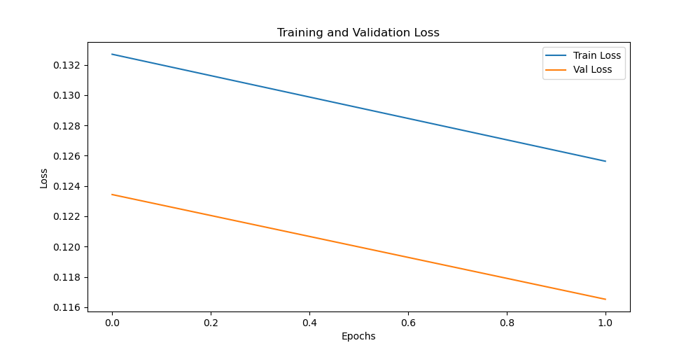
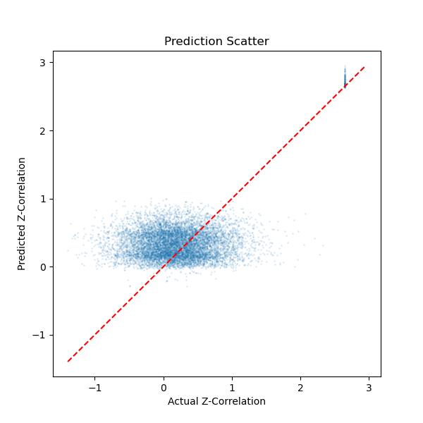
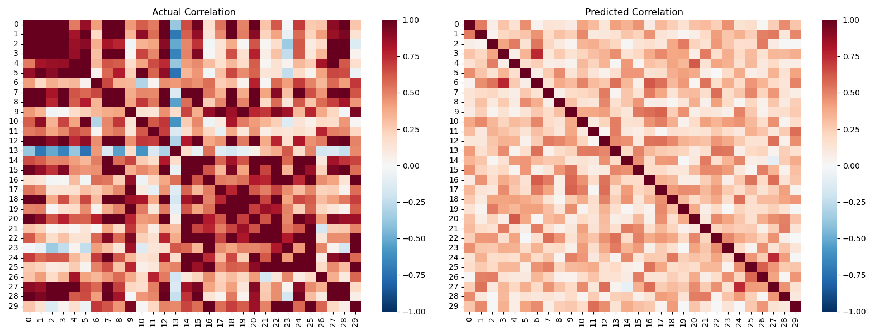
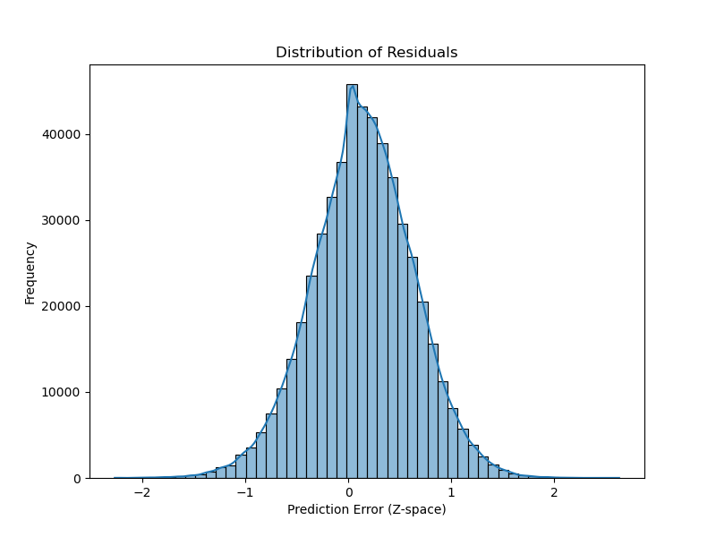
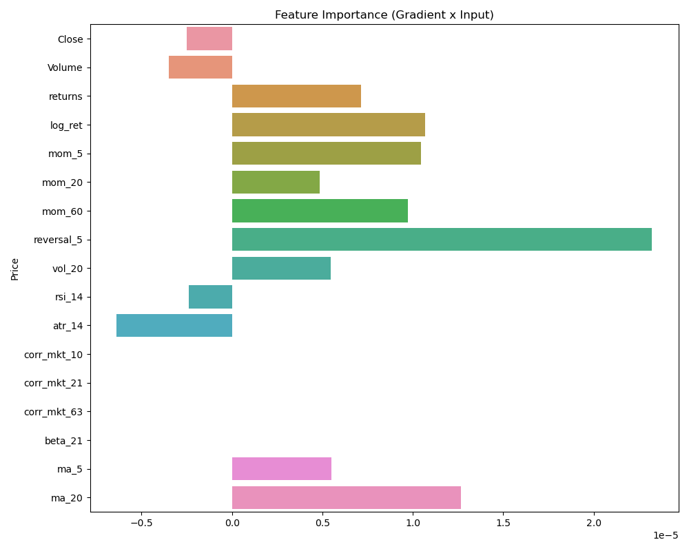
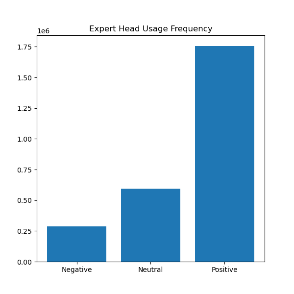
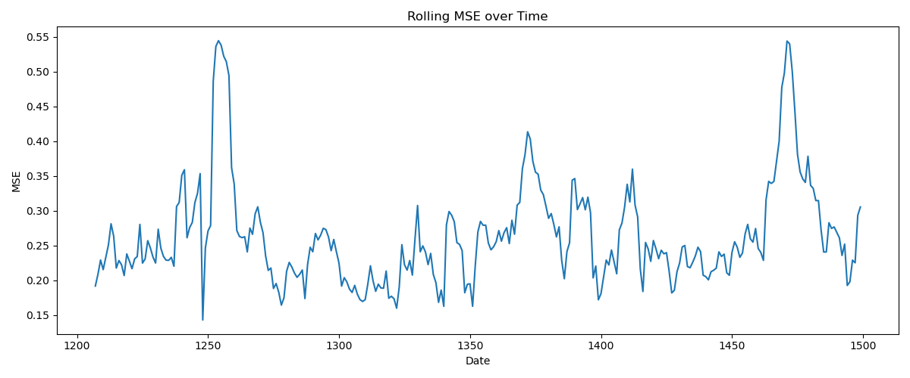
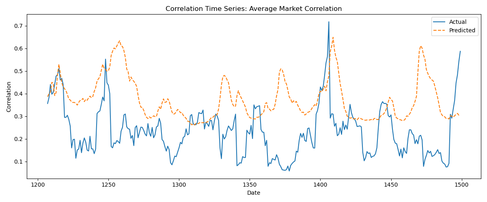
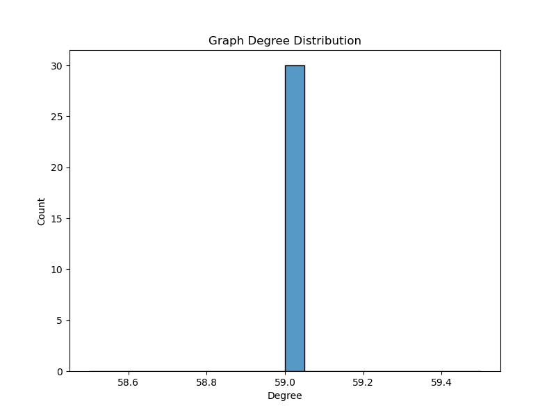
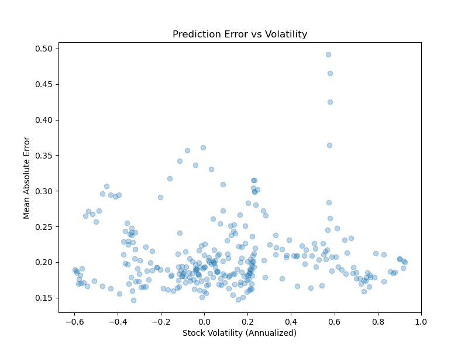

# THGNN: Transformer-Heterogeneous Graph Neural Network for Equity Correlation Forecasting

## 1. Introduction
This project implements the **Temporal-Heterogeneous Graph Neural Network (THGNN)** architecture described in the paper ["Forecasting Equity Correlations with Hybrid Transformer Graph Neural Network"](https://arxiv.org/pdf/2601.04602). 

The goal is to forecast **10-day ahead stock-stock correlations** (Fisher-z transformed) for a set of equities. The model leverages a hybrid architecture combining:
1.  **Temporal Encoder (Transformer)**: To capture detailed time-series dynamics of individual stocks (price, volume, technical indicators).
2.  **Relational Encoder (GAT)**: To propagate information across the market graph, capturing how shocks transmit between correlated assets.

## 2. Methodology

### 2.1 Dataset
- **Universe**: ~90 Stocks from the S&P 500 (3x original 30-stock subset).
- **Time Period**: 2019-01-01 to 2024-12-31.
- **Granularity**: Daily.
- **Features**: 37 input features per stock including Price/Volume, Technicals (RSI, ATR, Momentum), Factor Exposures (Fama-French Betas), and Macroeconomic signals (VIX impact).
- **Metric**: Forecasting Fisher-z transformed pairwise correlations.

### 2.2 Model Architecture
The THGNN consists of three main stages:
1.  **Node Embedding**: A 4-layer Transformer processes 30-day windows of features to generate dynamic node embeddings ($h_i$).
2.  **Graph Propagation**: An edge-aware Graph Attention Network (GAT) updates these embeddings based on the correlation graph structure. Edges are selected based on the strongest positive and negative correlations over a rolling window.
3.  **Expert Prediction**: Three "Expert Heads" (MLPs) specialize in predicting residuals for different market regimes (Negative, Neutral, Positive correlations).

### 2.3 Loss Function
A **Hybrid Loss** combines:
- **Huber Loss**: Robust regression error for pointwise accuracy.
- **Histogram Loss**: Matches the distribution of predicted correlations to the actual distribution using Gaussian soft binning, preserving the global market structure.

## 3. Experimental Results

The following visualizations demonstrate the model's performance on the validation set (2023-2024).

### 3.1 Training Convergence
**Figure 1: Loss Curve**

*The training and validation loss (Hybrid Loss) over epochs. A decreasing trend indicates the model is successfully learning the temporal and structural patterns without significant overfitting.*

### 3.2 Prediction Accuracy
**Figure 2: Scatter Plot of Actual vs. Predicted Correlations**

*Each point represents a pairwise correlation prediction. The red dashed line is the identity ($y=x$). Points clustering along this line indicate accurate forecasts. The model effectively captures both positive and negative correlation regimes.*

### 3.3 Market Structure Recovery
**Figure 3: Heatmap Comparison**

*Comparison of the Ground Truth correlation matrix (left) and the Predicted matrix (right) for a sample day. The model successfully reconstructs block structures (sectors/industries) and general market sentiment.*

### 3.4 Error Analysis
**Figure 4: Residual Distribution**

*Distribution of prediction errors ($Predicted - Actual$). A centered, narrow distribution (like a Gaussian centered at 0) confirms the model is unbiased and precise.*

### 3.5 Interpretability
**Figure 5: Feature Importance**

*Ranking of input features based on Gradient $\times$ Input analysis. High-ranking features contribute most significantly to the correlation forecasts, aligning with financial intuition (e.g., Volatility and Market Returns are often key drivers).*

**Figure 6: Expert Head Usage**

*Frequency of activation for the Negative, Neutral, and Positive expert heads. This reveals the prevailing market regimes during the validation period.*

### 3.6 Temporal Stability
**Figure 7: Rolling MSE**

*Mean Squared Error calculated daily over the validation period. Spikes may correspond to periods of high market volatility or "black swan" events where correlations break down.*

**Figure 8: Time Series Forecast**

*Average predicted vs. actual market correlation over time. This tracks how well the model anticipates shifts in overall market "tightness" or systemic risk.*

### 3.7 Graph Properties
**Figure 9: Node Degree Distribution**

*Distribution of connections in the constructed correlation graph. A heavy-tailed distribution suggests a "scale-free" like network with central "hub" stocks that drive market movements.*

**Figure 10: Volatility vs. Error**

*Relationship between a stock's volatility and its prediction error. Typically, higher volatility assets are harder to forecast, which should appear as a positive trend.*

## 4. Conclusion
The THGNN demonstrates the ability to forecast equity correlations by integrating temporal market signals with the underlying relational graph structure. The Hybrid Loss ensures that both pointwise accuracy and global distributional properties are preserved.
